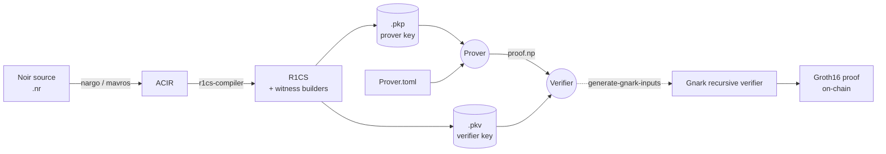

<div align="center">


[](https://github.com/worldfnd/provekit/actions/workflows/ci.yml)
[](https://rustup.rs/)
[](./License.md)

[Getting Started](#getting-started) · [Examples](./noir-examples/) · [Architecture](#architecture) · [Contributing](./CONTRIBUTING.md) · [Issues](https://github.com/worldfnd/provekit/issues)

</div>

ProveKit takes a [Noir](https://noir-lang.org/) circuit, compiles it to R1CS, and produces a [WHIR](https://github.com/WizardOfMenlo/whir) proof. It is designed for mobile and other constrained environments and ships with a custom BN254 hash engine ([Skyscraper](skyscraper/)), swap-to-disk memory management for large witnesses, and C FFI bindings for iOS and Android. For on-chain settlement, a [gnark](https://github.com/Consensys/gnark)-based recursive verifier wraps proofs in Groth16.

---

## Architecture



### Crates

| Layer | Path | Purpose |
| :--- | :--- | :--- |
| CLI | `tooling/cli/` | `provekit-cli`: prepare, prove, verify, inspect |
| Compiler | `provekit/r1cs-compiler/` | Noir ACIR → R1CS with binop, range-check, and lookup-table optimizations |
| Prover | `provekit/prover/` | Witness solving, R1CS compression, WHIR commitment and sumcheck |
| Verifier | `provekit/verifier/` | Fiat–Shamir replay, sumcheck check, public input binding |
| Hash engine | `skyscraper/` | Custom BN254 hash with SIMD-accelerated field arithmetic (aarch64) |
| FFI | `tooling/provekit-ffi/` | Panic-safe C ABI for iOS, Android, Python, Swift, Kotlin |
| Recursive verifier | `recursive-verifier/` | Go + gnark wrapper that produces a Groth16 proof of WHIR verification |

---

## Example

[`noir-examples/basic`](./noir-examples/basic/) proves knowledge of a Poseidon hash preimage:

```rust
use dep::poseidon2;

fn main(plains: [Field; 2], result: Field) {
    let hash = poseidon2::bn254::hash_2(plains);
    assert(hash == result);
}
```

Compile, prove, and verify end-to-end:

```sh
cd noir-examples/basic
cargo run --release --bin provekit-cli prepare
cargo run --release --bin provekit-cli prove
cargo run --release --bin provekit-cli verify
```

Every step uses sensible defaults. `prepare` compiles the Noir package in the current directory and writes `<circuit>.pkp` and `<circuit>.pkv` next to `Nargo.toml`. `prove` reads those plus `./Prover.toml` and writes `./proof.np`. `verify` reads them back. Override any path with `-p`/`--pkp`, `-i`/`--input`, `-o`/`--out`, `-v`/`--verifier`, or `--proof`.

---

## Getting Started

You need [Rust nightly](https://rustup.rs/) (the toolchain is pinned in `rust-toolchain.toml`, so rustup picks it up automatically) and [`nargo`](https://noir-lang.org/) at version `v1.0.0-beta.19`:

```sh
noirup --version v1.0.0-beta.19
```

<details>
<summary><strong>Compile a circuit</strong></summary><br>

The default flow uses `nargo` as the compiler. `prepare` runs it for you and writes the prover and verifier keys:

```sh
cd noir-examples/poseidon-rounds
cargo run --release --bin provekit-cli prepare
```

Or use [`mavros`](https://github.com/reilabs/mavros) for circuits that benefit from its R1CS frontend:

```sh
cd noir-examples/poseidon-rounds
mavros compile
cargo run --release --bin provekit-cli prepare \
  --compiler mavros ./target/basic.json --r1cs ./target/r1cs.bin
```

`prepare` accepts `--hash skyscraper|sha256|keccak|blake3|poseidon2` to pick the Merkle and Fiat–Shamir hash. Skyscraper is the default and the only one with hardware acceleration.

</details>

<details open>
<summary><strong>Prove and verify</strong></summary><br>

```sh
cargo run --release --bin provekit-cli prove
cargo run --release --bin provekit-cli verify
```

Both commands work with zero arguments when run from the directory holding the `.pkp`/`.pkv` and `Prover.toml`. The proof lands at `./proof.np`.

</details>

<details>
<summary><strong>Recursive on-chain verification</strong></summary><br>

Generate gnark inputs and run the recursive verifier to get a Groth16 proof:

```sh
cargo run --release --bin provekit-cli generate-gnark-inputs ./verifier.pkv ./proof.np

cd recursive-verifier
go run cmd/cli/main.go \
  --config ../noir-examples/poseidon-rounds/params_for_recursive_verifier \
  --r1cs ../noir-examples/poseidon-rounds/r1cs.json
```

The Groth16 proving key and the WHIR R1CS must be generated together — they are not interchangeable across runs.

</details>

<details>
<summary><strong>Benchmark against Barretenberg</strong></summary><br>

Install [Barretenberg](https://github.com/AztecProtocol/aztec-packages/blob/master/barretenberg/bbup/README.md) and [hyperfine](https://github.com/sharkdp/hyperfine), then:

```sh
cd noir-examples/poseidon-rounds
nargo compile
cargo run --release --bin provekit-cli prepare
hyperfine \
  'nargo execute && bb prove -b ./target/basic.json -w ./target/basic.gz -o ./target' \
  '../../target/release/provekit-cli prove'
```

The internal benchmark suite:

```sh
cargo test -p provekit-bench --bench bench
```

</details>

---

## Inspection and Profiling

Inspect circuits and proofs without a full prove run:

```sh
# Constraint count and R1CS structure (after `nargo compile`)
cargo run --release --bin provekit-cli circuit_stats ./target/basic.json

# Proving key size breakdown
cargo run --release --bin provekit-cli analyze-pkp ./prover.pkp

# Public input names and values
cargo run --release --bin provekit-cli show-inputs ./verifier.pkv ./proof.np
```

Profile the prover with the tool that fits your platform:

| Tool | Measures | Command |
| :--- | :--- | :--- |
| Built-in allocator stats | Memory (peak, alloc count) | `cargo run --release --bin provekit-cli prove` — the `profiling-allocator` feature is on by default |
| [Tracy](https://github.com/wolfpld/tracy) | CPU + memory (interactive GUI) | `cargo build --release --features tracy --bin provekit-cli`, then run the binary with `--tracy` while Tracy is listening. On macOS, run `dsymutil` on the binary first to get call stacks. |
| [Samply](https://github.com/mstange/samply) | CPU flamegraphs | `samply record -r 10000 -- ./target/release/provekit-cli prove` |
| [Instruments](https://crates.io/crates/cargo-instruments) | Allocations (macOS only) | `cargo instruments --template Allocations --release --bin provekit-cli prove` |

---

## Project Status

ProveKit is under active development. Proof and key formats are versioned, but breaking changes still occur on `main`; pin a commit if you depend on a specific format. See [CONTRIBUTING.md](./CONTRIBUTING.md) for development guidelines.

---

## Acknowledgements

- [**WHIR**](https://github.com/WizardOfMenlo/whir) — the polynomial commitment scheme and sumcheck protocol the proof system is built on. `WhirR1CSScheme` wraps it for R1CS satisfiability over BN254.
- [**Spongefish**](https://github.com/arkworks-rs/spongefish) — Fiat–Shamir transcript library from arkworks. All challenge derivation goes through its `DuplexSponge` API.
- [**gnark-skyscraper**](https://github.com/reilabs/gnark-skyscraper) — Go implementation of the Skyscraper hash. The recursive verifier needs it to reproduce the Merkle commitments the Rust prover produced.
- [**Noir**](https://github.com/noir-lang/noir) — the ZK DSL ProveKit compiles from. Write your circuit in Noir, run `nargo` to get ACIR, and ProveKit handles the rest.

## License

Released under the [MIT License](./License.md). Copyright (c) 2025 World Foundation.
