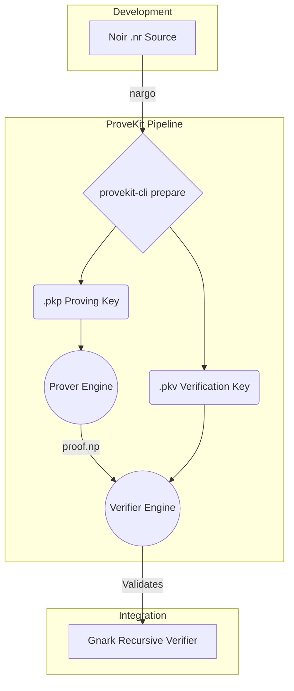

<div align="center">


[](https://github.com/worldfnd/provekit/actions)
[](https://rustup.rs/)
[](./License.md)

[Getting Started](#getting-started) · [Examples](./noir-examples/) · [Contributing](./CONTRIBUTING.md) · [Issues](https://github.com/worldfnd/provekit/issues)

</div>

ProveKit lets you take a Noir circuit, compile it to R1CS, and generate a WHIR proof. It's built for mobile and constrained environments and ships with a custom BN254 hash engine ([Skyscraper](skyscraper/)), swap-to-disk memory management, and C FFI for iOS and Android. If you need on-chain verification, there's a gnark recursive verifier that wraps proofs in Groth16.

---

## Architecture



### Crates

| Layer | Crate | Description |
| :--- | :--- | :--- |
| CLI | `tooling/cli/` | `provekit-cli`: prepare, prove, verify, inspect |
| Prover / Verifier | `provekit/prover/`<br>`provekit/verifier/` | WHIR sumcheck, witness solving, commitment |
| Compiler | `provekit/r1cs-compiler/` | Noir ACIR → R1CS with constraint optimizations |
| Hash engine | `skyscraper/` | Custom BN254 hash with SIMD-accelerated field arithmetic |
| Interop | `tooling/provekit-gnark/`<br>`gnark-whir/` | Rust ↔ Go/gnark bridge for recursive verification |
| FFI | `tooling/provekit-ffi/` | C-compatible bindings for iOS, Android, and Python |

---

## Example

Here's [`noir-examples/basic-4`](./noir-examples/basic-4/), which proves knowledge of inputs `(a, b)` satisfying `(a + b) * (a - b) == result`:

```rust
fn main(a: Field, b: Field) -> pub Field {
    let sum = a + b;
    let diff = a - b;
    sum * diff
}
```

```sh
cd noir-examples/basic-4
nargo compile
cargo run --release --bin provekit-cli prepare ./target/basic.json --pkp prover.pkp --pkv verifier.pkv
cargo run --release --bin provekit-cli prove prover.pkp Prover.toml -o proof.np
cargo run --release --bin provekit-cli verify verifier.pkv proof.np
```

---

## Getting Started

You need nargo `v1.0.0-beta.11` and Rust nightly. Toolchain is pinned in `rust-toolchain.toml`; rustup picks it up automatically.

<details>
<summary><strong>1. Install nargo</strong></summary><br>

```sh
noirup --version v1.0.0-beta.11
```
</details>

<details>
<summary><strong>2. Compile a circuit</strong></summary><br>

The steps below use `poseidon-rounds` as the example circuit.

```sh
cd noir-examples/poseidon-rounds
nargo compile
cargo run --release --bin provekit-cli prepare ./target/basic.json --pkp ./prover.pkp --pkv ./verifier.pkv
```
</details>

<details open>
<summary><strong>3. Prove and verify</strong></summary><br>

```sh
# Generate a proof
cargo run --release --bin provekit-cli prove ./prover.pkp ./Prover.toml -o ./proof.np

# Verify locally
cargo run --release --bin provekit-cli verify ./verifier.pkv ./proof.np
```

**Recursive on-chain verification:**
```sh
cargo run --release --bin provekit-cli generate-gnark-inputs ./prover.pkp ./proof.np

cd ../../recursive-verifier
go run cmd/cli/main.go \
  --config ../noir-examples/poseidon-rounds/params_for_recursive_verifier \
  --r1cs ../noir-examples/poseidon-rounds/r1cs.json
```
</details>

<details>
<summary><strong>4. Benchmark</strong></summary><br>

Benchmark against [Barretenberg](https://github.com/AztecProtocol/aztec-packages/blob/master/barretenberg/bbup/README.md) with [hyperfine](https://github.com/sharkdp/hyperfine):

```sh
cd noir-examples/poseidon-rounds
cargo run --release --bin provekit-cli prepare ./target/basic.json --pkp ./prover.pkp --pkv ./verifier.pkv
hyperfine \
  'nargo execute && bb prove -b ./target/basic.json -w ./target/basic.gz -o ./target' \
  '../../target/release/provekit-cli prove ./prover.pkp ./Prover.toml'
```

Internal benchmark suite:
```sh
cargo test -p provekit-bench --bench bench
```
</details>

---

## Profiling

| Tool | Measures | Command |
| :--- | :--- | :--- |
| Built-in allocator stats | Memory | `cargo run --release --features profiling --bin provekit-cli prove ...` |
| [Tracy](https://github.com/wolfpld/tracy) | CPU + memory (interactive GUI) | `cargo build --release --features profiling` then run the binary with Tracy listening. On macOS, run `dsymutil` on the binary first to get call stacks. |
| [Samply](https://github.com/mstange/samply) | CPU flamegraphs | `samply record -r 10000 -- ./target/release/provekit-cli prove ...` |
| [Instruments](https://crates.io/crates/cargo-instruments) | Allocations (macOS only) | `cargo instruments --template Allocations --release --bin provekit-cli prove ...` |

If you want to inspect without running a proof:
```sh
provekit-cli circuit_stats ./target/basic.json      # constraint count and R1CS structure
provekit-cli analyze-pkp ./prover.pkp               # proving key size breakdown
provekit-cli show-inputs ./verifier.pkv ./proof.np  # public input names and values
```

---

## Acknowledgements

- [**WHIR**](https://github.com/WizardOfMenlo/whir): the polynomial commitment scheme and sumcheck protocol the proof system is built on. `WhirR1CSScheme` wraps it for R1CS satisfiability over BN254.

- [**Spongefish**](https://github.com/arkworks-rs/spongefish): Fiat-Shamir library from arkworks. All transcript construction and challenge derivation goes through its `DuplexSponge` API.

- [**gnark-skyscraper**](https://github.com/reilabs/gnark-skyscraper): Go implementation of the Skyscraper hash. The recursive verifier needs it to reproduce the same Merkle commitments as the Rust prover.

- [**Noir**](https://github.com/noir-lang/noir): the ZK DSL we compile from. Write your circuit in Noir, run nargo to get ACIR, and ProveKit handles the rest.
