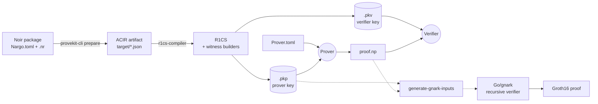

# ProveKit

<div align="center">


[](https://github.com/worldfnd/provekit/actions)
[](https://rustup.rs/)
[](./License.md)

[Quick Start](#quick-start) · [How It Works](#how-it-works) · [Examples](./noir-examples/) · [Repository Map](#repository-map) · [Contributing](./CONTRIBUTING.md)

</div>

ProveKit is a zero-knowledge proof system toolkit that compiles [Noir](https://noir-lang.org/) programs to R1CS constraints and generates and verifies [WHIR](https://github.com/WizardOfMenlo/whir) proofs using a Spartan-based protocol. It includes custom SIMD-accelerated field arithmetic, memory-efficient algorithms for resource-constrained environments, C-compatible FFI, and recursive verification support for on-chain Groth16 applications.

## Why ProveKit

- **Noir frontend:** write circuits in Noir and use ProveKit to compile, prepare keys, prove, and verify with one CLI.
- **Post-quantum secure proofs:** produce WHIR proofs designed around post-quantum security assumptions.
- **Integration-ready surface:** use ProveKit from Rust or from C-compatible FFI hosts such as Swift, Kotlin, Python, and JavaScript.
- **Recursive verifier for on-chain Groth16:** export prover-key/proof data for the gnark recursive verifier when an on-chain Groth16 wrapper is required.

## Quick Start

### Prerequisites

Install Rust with `rustup`. This repository includes `rust-toolchain.toml`, so Cargo picks the pinned nightly automatically.

Install the Noir toolchain version used by v1 examples:

```sh
noirup --version v1.0.0-beta.21
```

### Run a proof

The smallest v1 end-to-end path is the [`noir-examples/basic-4`](./noir-examples/basic-4/) package:

```sh
cd noir-examples/basic-4
cargo run --release --bin provekit-cli prepare
cargo run --release --bin provekit-cli prove
cargo run --release --bin provekit-cli verify
```

`prepare` compiles the Noir package in the current directory and writes `<circuit>.pkp` and `<circuit>.pkv`. `prove` reads `<circuit>.pkp` plus `./Prover.toml` and writes `./proof.np`. `verify` reads `<circuit>.pkv` and `./proof.np`.

### Command reference

| Command | Purpose | Key options |
| :--- | :--- | :--- |
| `prepare [program-dir]` | Compile a Noir package and write prover/verifier keys | `--package`, `--workspace`, `--target-dir`, `--pkp`/`-p`, `--pkv`/`-v`, `--force` |
| `prove` | Produce `proof.np` from a prover key and inputs | `--prover`/`-p`, `--input`/`-i`, `--out`/`-o` |
| `verify` | Verify a proof against a verifier key | `--verifier`/`-v`, `--proof` |
| `generate-gnark-inputs` | Export recursive-verifier inputs | positional prover key, positional proof, `--params`, `--r1cs` |
| `circuit-stats` | Inspect ACIR and R1CS structure | positional compiled circuit JSON |
| `analyze-pkp` | Inspect prover-key size breakdown | positional `.pkp` file |
| `show-inputs` | Display public inputs from a proof | positional `.pkv` file, positional proof, `--hex` |

Read the table per command: the short `-p` flag changes meaning between `prepare` and `prove`.

## How It Works



The v1 CLI compiles Noir packages during `prepare`, saves the ACIR artifact under the package target directory, lowers ACIR into R1CS, constructs witness builders, and writes `.pkp`/`.pkv` key files. Recursive verification exports use the `.pkp` prover key plus `proof.np` because v1 needs prover-side WHIR/R1CS parameters to create the gnark input files.

## Example Circuit

[`noir-examples/basic-4`](./noir-examples/basic-4/) proves knowledge of inputs `(a, b)` satisfying `(a + b) * (a - b) == result`:

```rust
fn main(a: Field, b: Field) -> pub Field {
    let sum = a + b;
    let diff = a - b;
    sum * diff
}
```

For larger circuits and integration experiments, see [`noir-examples/`](./noir-examples/).

## Repository Map

| Layer | Path | Crate/package | Purpose |
| :--- | :--- | :--- | :--- |
| Common types | `provekit/common/` | `provekit-common` | Shared R1CS, witness, proof, key, serialization, and transcript utilities |
| Compiler | `provekit/r1cs-compiler/` | `provekit-r1cs-compiler` | Noir ACIR → R1CS with constraint optimizations |
| Prover | `provekit/prover/` | `provekit-prover` | WHIR proving, witness solving, R1CS compression, and commitments |
| Verifier | `provekit/verifier/` | `provekit-verifier` | WHIR verification, transcript replay, sumcheck checks, and public input binding |
| CLI | `tooling/cli/` | `provekit-cli` | Commands for prepare, prove, verify, inspection, and gnark input generation |
| Benchmarks | `tooling/provekit-bench/` | `provekit-bench` | Benchmark utilities and regression coverage for proving workflows |
| FFI | `tooling/provekit-ffi/` | `provekit-ffi` | C-compatible bindings for Swift/iOS, Kotlin/Android, Python, JavaScript, and other FFI hosts |
| Gnark export | `tooling/provekit-gnark/` | `provekit-gnark` | Rust-side export/config bridge for recursive verification artifacts |
| Verifier server | `tooling/verifier-server/` | `verifier-server` | HTTP server that orchestrates Rust proof handling and Go verifier execution |
| NTT | `ntt/` | `provekit-ntt` | Number Theoretic Transform implementation for BN254 polynomial evaluation paths |
| Hash engine | `skyscraper/` | first-party Skyscraper crates | Custom BN254 hash and SIMD-accelerated field arithmetic support |
| Recursive verifier | `recursive-verifier/` | Go module | Go + gnark recursive verifier for on-chain Groth16 wrappers |
| Examples | `noir-examples/` | Noir packages | Noir example circuits and R1CS compiler test programs |

## Advanced Usage

- **Explicit project paths:** run `provekit-cli prepare ./noir-examples/poseidon-rounds --pkp ./prover.pkp --pkv ./verifier.pkv` when preparing a package outside the current directory or when you want fixed key names.
- **Recursive verifier inputs:** `provekit-cli generate-gnark-inputs <prover.pkp> <proof.np>` writes `params_for_recursive_verifier` and `r1cs.json` by default; use `--params` and `--r1cs` to override those paths.
- **Inspection commands:** use `circuit-stats` for ACIR/R1CS structure, `analyze-pkp` for prover-key size breakdowns, and `show-inputs` for public inputs.
- **FFI integration:** start in [`tooling/provekit-ffi/`](tooling/provekit-ffi/) for C ABI headers, mobile build targets, and host-language examples.
- **Benchmarking:** use [`tooling/provekit-bench/`](tooling/provekit-bench/) for internal benchmark coverage, or compare CLI proof generation with external tools using `hyperfine`.

### Profiling

| Tool | Measures | Command |
| :--- | :--- | :--- |
| Built-in allocator stats | Memory | `cargo run --release --features profiling --bin provekit-cli prove ...` |
| [Tracy](https://github.com/wolfpld/tracy) | CPU and memory | `cargo build --release --features profiling` then run the binary with Tracy listening. On macOS, run `dsymutil` on the binary first to get call stacks. |
| [Samply](https://github.com/mstange/samply) | CPU flamegraphs | `samply record -r 10000 -- ./target/release/provekit-cli prove ...` |
| [Instruments](https://crates.io/crates/cargo-instruments) | Allocations on macOS | `cargo instruments --template Allocations --release --bin provekit-cli prove ...` |

## Project Status

This README documents the `v1` branch, the current stable ProveKit interface. The `main` branch may differ while new proof and key formats are being developed.

## Contributing

Contributions are welcome. See [`CONTRIBUTING.md`](./CONTRIBUTING.md) for development guidelines and use the [issue tracker](https://github.com/worldfnd/provekit/issues) for bugs, feature requests, and design discussion.

## Acknowledgements

- [**WHIR**](https://github.com/WizardOfMenlo/whir) — polynomial commitment scheme and sumcheck protocol used by the proof system.
- [**Spongefish**](https://github.com/arkworks-rs/spongefish) — Fiat–Shamir transcript library used for challenge derivation.
- [**gnark-skyscraper**](https://github.com/reilabs/gnark-skyscraper) — Go implementation used by the recursive verifier to reproduce Skyscraper commitments.
- [**Noir**](https://github.com/noir-lang/noir) — ZK DSL compiled by ProveKit.

## License

Released under the [MIT / Apache 2.0 licenses](./License.md). Copyright (c) 2026 World Foundation.
