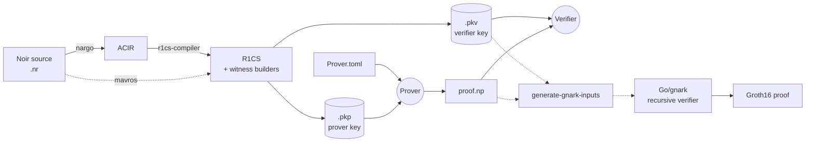

# ProveKit

<div align="center">


[](https://github.com/worldfnd/provekit/actions/workflows/ci.yml)
[](https://rustup.rs/)
[](./LICENSE.md)

[Quick Start](#quick-start) · [How It Works](#how-it-works) · [Examples](./noir-examples/) · [Repository Map](#repository-map) · [Contributing](./CONTRIBUTING.md)

</div>

ProveKit compiles [Noir](https://noir-lang.org/) circuits into R1CS and produces [WHIR](https://github.com/WizardOfMenlo/whir) proofs. It is built for teams that need a native proving stack, verifier artifacts, C-compatible FFI integration surfaces, and an optional [gnark](https://github.com/Consensys/gnark) recursion path for a Groth16 wrapper.

## Why ProveKit

- **Noir in, WHIR proof out:** compile Noir packages, prepare prover/verifier keys, prove, and verify with one CLI.
- **R1CS-first architecture:** inspect circuit structure, key sizes, public inputs, and proof artifacts without changing the proving flow.
- **Integration-ready surface:** use the CLI for local workflows or the C ABI crate for Swift, Kotlin, Python, and other FFI consumers.
- **Recursive verification path:** export the verifier/proof data needed by the Go/gnark recursive verifier when a Groth16 wrapper is required.

## Quick Start

### Prerequisites

Install the pinned Rust toolchain with `rustup`; this repository includes `rust-toolchain.toml`, so Cargo picks the right nightly automatically. ProveKit also expects `nargo` `v1.0.0-beta.19`:

```sh
noirup --version v1.0.0-beta.19
```

### Run a proof

The smallest end-to-end path is the [`noir-examples/basic`](./noir-examples/basic/) package:

```sh
cd noir-examples/basic
cargo run --release --bin provekit-cli prepare
cargo run --release --bin provekit-cli prove
cargo run --release --bin provekit-cli verify
```

`prepare` writes a **ProveKit Prover** key (`.pkp`) and a **ProveKit Verifier** key (`.pkv`). `prove` reads the PKP plus `Prover.toml` and writes `proof.np`. `verify` reads the PKV and the proof.

### Command reference

| Command | Purpose | Key options |
| :--- | :--- | :--- |
| `prepare` | Compile a Noir package and write prover/verifier keys | `--pkp`/`-p`, `--pkv`/`-v`, `--hash`; default hash: `skyscraper` |
| `prove` | Produce `proof.np` from a prover key and inputs | `--prover`/`-p`, `--input`/`-i`, `--out`/`-o` |
| `verify` | Verify a proof against a verifier key | `--verifier`/`-v`, `--proof` |

Read the table per command: the short `-p` flag changes meaning between `prepare` and `prove`.

Available `prepare --hash` choices are `skyscraper`, `sha256`, `keccak`, `blake3`, and `poseidon2`.

## How It Works



The default frontend runs `nargo`, lowers the resulting ACIR into R1CS, and writes `.pkp`/`.pkv` key files. Circuits that benefit from a direct R1CS frontend can use [`mavros`](https://github.com/reilabs/mavros) with `prepare --compiler mavros` and an explicit `--r1cs` file.

## Example Circuit

[`noir-examples/basic`](./noir-examples/basic/) proves knowledge of a Poseidon hash preimage:

```rust
use dep::poseidon2;

fn main(plains: [Field; 2], result: Field) {
    let hash = poseidon2::bn254::hash_2(plains);
    assert(hash == result);
}
```

For larger circuits and integration experiments, see [`noir-examples/`](./noir-examples/).

## Repository Map

| Layer | Path | Purpose |
| :--- | :--- | :--- |
| CLI | `tooling/cli/` | `provekit-cli` commands for prepare, prove, verify, inspection, and gnark input generation |
| Compiler | `provekit/r1cs-compiler/` | Noir ACIR → R1CS lowering, including binop, range-check, and lookup-table handling |
| Prover | `provekit/prover/` | Witness solving, R1CS compression, WHIR commitments, and proof generation |
| Verifier | `provekit/verifier/` | Fiat–Shamir replay, sumcheck verification, and public input binding |
| Hash engine | [`skyscraper/`](skyscraper/) | BN254 hash implementation used by the Skyscraper hash configuration |
| FFI | `tooling/provekit-ffi/` | C ABI bindings for native and mobile hosts, including Swift/Kotlin-oriented examples |
| Recursive verifier | `recursive-verifier/` | Go + gnark verifier wrapper for Groth16 recursion |

## Advanced Usage

- **Direct R1CS frontend:** run `mavros compile`, then call `provekit-cli prepare --compiler mavros <basic.json> --r1cs <r1cs.bin>`.
- **Recursive verifier inputs:** `provekit-cli generate-gnark-inputs <verifier.pkv> <proof.np>` writes `params_for_recursive_verifier` and `r1cs.json` by default; use `--params` and `--r1cs` to override those paths.
- **Inspection commands:** use `circuit-stats`, `analyze-pkp`, and `show-inputs` to inspect ACIR/R1CS structure, prover-key size breakdowns, and public inputs.
- **FFI integration:** start in [`tooling/provekit-ffi/`](tooling/provekit-ffi/) for C ABI headers, mobile build targets, and host-language examples.
- **Profiling:** use the built-in allocator stats from the CLI, or build with Tracy support when interactive profiling is needed.

## Project Status

ProveKit is under active development. Proof and key formats are versioned, but breaking changes can still occur on `main`; pin a commit if you depend on a specific format.

## Contributing

Contributions are welcome. See [`CONTRIBUTING.md`](./CONTRIBUTING.md) for development guidelines and use the [issue tracker](https://github.com/worldfnd/provekit/issues) for bugs, feature requests, and design discussion.

## Acknowledgements

- [**WHIR**](https://github.com/WizardOfMenlo/whir) — polynomial commitment scheme and sumcheck protocol used by the proof system.
- [**Spongefish**](https://github.com/arkworks-rs/spongefish) — Fiat–Shamir transcript library used for challenge derivation.
- [**gnark-skyscraper**](https://github.com/reilabs/gnark-skyscraper) — Go implementation used by the recursive verifier to reproduce Skyscraper commitments.
- [**Noir**](https://github.com/noir-lang/noir) — ZK DSL compiled by ProveKit.

## License

Released under the [MIT License](./LICENSE.md). Copyright (c) 2025 World Foundation.
