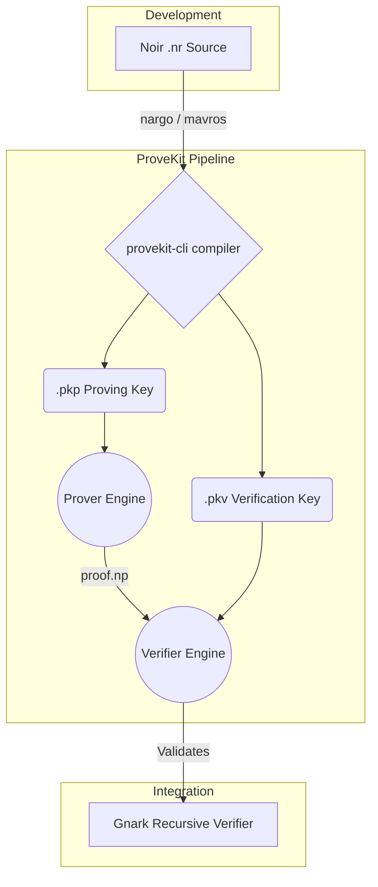

<div align="center">

# 🧮 ProveKit

**The edge-native, zero-knowledge runtime and R1CS compilation toolkit.**

[](https://github.com/atheon/provekit/actions)
[](https://rustup.rs/)
[](#)

*Empowering developers to build lightweight, mobile-optimized cryptographic applications within the Noir and Gnark ecosystems.*

[Explore the Docs](#-getting-started) · [Report Bug](../../issues) · [Request Feature](../../issues)

</div>

---

## ✨ Why ProveKit?

Developing cutting-edge cryptography for constrained edge devices demands more than generic tooling. **ProveKit** bridges the gap between high-level ZK languages and high-performance, mobile-first execution.

- **📱 Edge-Optimized:** Zero compromises. ProveKit features bespoke memory management, custom allocators, and integrates natively with macOS `instruments`, `samply`, and `tracy` to guarantee an ultra-low footprint.
- **⬛ Noir Native:** Built heavily on the [Noir](https://noir-lang.org/) stack. ProveKit consumes native Noir circuits, providing immediate interoperability. 
- **⚡ M31/CM31 First:** Leverages the `skyscraper` backend for ruthlessly efficient field arithmetic.
- **🔄 Universal Recursion:** Gnark bindings allow you to take mobile-generated proofs and securely verify them on-chain via recursive rollups.

---

## 🏗️ Architecture

ProveKit implements a highly decoupled pipeline—from constraint generation to proof verification. 



### Module Landscape

| Layer | Component | Description |
| :--- | :--- | :--- |
| **Tooling** | `tooling/cli/` | The unified binary interface (`provekit-cli`). |
| **Logic** | `provekit/prover/`<br>`provekit/verifier/` | Core ZK proving systems algorithms and verification targets. |
| **Constraints** | `provekit/r1cs-compiler/` | Translates Noir execution environments down to R1CS formats. |
| **Maths** | `skyscraper/` | Hand-optimized CM31/M31 field implementations. |
| **Interops**| `tooling/provekit-gnark/`<br>`gnark-whir/`| Bridges gap between Rust proofs and Go / Gnark validations. |

---

## 🚀 Getting Started

ProveKit tightly integrates with the Noir (`nargo`) development chain. Standard installation requires a strict cross-compatible version of the environment.

<details>
<summary><strong>1️⃣ Setup Dependencies</strong></summary><br>

Install the exact Noir version required by our bridging components:
```sh
noirup --version v1.0.0-beta.19
```
*Tip: Ensure your Rust toolchain is on at least `1.75`.*
</details>

<details>
<summary><strong>2️⃣ Compile a Circuit</strong></summary><br>

Our examples use `poseidon-rounds` as the canonical benchmark. You can use standard Noir or `mavros`.

**A. Using nargo:**
```sh
cd noir-examples/poseidon-rounds
nargo compile
cargo run --release --bin provekit-cli prepare ./target/basic.json --pkp ./prover.pkp --pkv ./verifier.pkv
```

**B. Using mavros:**
```sh
cd noir-examples/poseidon-rounds
mavros compile
cargo run --release --bin provekit-cli prepare --compiler mavros ./target/basic.json --r1cs ./target/r1cs.bin --pkp ./prover.pkp --pkv ./verifier.pkv
```
</details>

<details open>
<summary><strong>3️⃣ Prove & Verify Workflow</strong></summary><br>

Once the constraint keys are extracted, run the high-performance prover:

```sh
# Generate the dense ZK proof
cargo run --release --bin provekit-cli prove ./prover.pkp ./Prover.toml -o ./proof.np

# Locally verify
cargo run --release --bin provekit-cli verify ./verifier.pkv ./proof.np
```

**Generate inputs for the Gnark circuit & Recursively Verify:**
```sh
cargo run --release --bin provekit-cli generate-gnark-inputs ./verifier.pkv ./proof.np

cd ../../recursive-verifier
go run cmd/cli/main.go --config ../noir-examples/poseidon-rounds/params_for_recursive_verifier --r1cs ../noir-examples/poseidon-rounds/r1cs.json
```
</details>

<details>
<summary><strong>4️⃣ Benchmark Tooling</strong></summary><br>

ProveKit can natively be benchmarked against alternative prover backends like [Barretenberg](https://github.com/AztecProtocol/aztec-packages/blob/master/barretenberg/bbup/README.md).

```sh
cd noir-examples/poseidon-rounds
cargo run --release --bin provekit-cli prepare ./target/basic.json --pkp ./prover.pkp --pkv ./verifier.pkv
hyperfine 'nargo execute && bb prove -b ./target/basic.json -w ./target/basic.gz -o ./target' '../../target/release/provekit-cli prove ./prover.pkp ./Prover.toml'
```

**Run internal benchmarks:**
```sh
cargo test -p provekit-bench --bench bench
```
</details>


---

## 🛠️ Diagnostics & Profiling

ProveKit exposes industry-grade telemetry specifically tuned for ensuring applications won't blow up a mobile app's RAM budget. 

| Tooling Platform | Description & Command Structure |
| :--- | :--- |
| **Native Diagnostics** | Toggle internal allocators: <br>`cargo run --release --features profiling --bin provekit-cli prove ...` |
| **Tracy GUI** | Requires instrumented binary build: <br>`cargo build --release --features profiling` *(Note: Use `dsymutil` on macOS)* |
| **Samply (CPU)** | Native CPU Flamegraphs: <br>`samply record -r 10000 -- <binary_path> prove ...` |
| **Apple Instruments** | Native macOS allocation tracking: <br>`cargo instruments --template Allocations --release --bin provekit-cli prove ...` |

> [!TIP]
> **Static Analysis:** You can bypass execution to statically measure proof density and logic utilization:
> `provekit-cli circuit_stats ./target/basic.json` and `provekit-cli analyze-pkp ./prover.pkp`.

---

## 📚 Related Projects

Designed in lockstep with industry leaders. Be sure to explore integrated systems:

* [**🌪️ WHIR**](https://github.com/WizardOfMenlo/whir) — The underlying cryptography implementations.
* [**🧽 Spongefish**](https://github.com/arkworks-rs/spongefish) — Core primitives from the `arkworks-rs` team.
* [**⬛ Noir**](https://github.com/noir-lang/noir) — The zero-knowledge domain specific language proving stack. 

---
<div align="center">
<i>Driven by research, built for production.</i>
</div>
