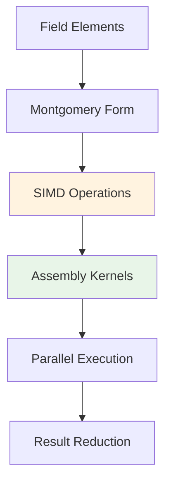

# Block Multiplier

The Block Multiplier component provides highly optimized finite field arithmetic operations, specifically designed for the BN254 elliptic curve field used in zero-knowledge proofs.

## Overview

Block Multiplier delivers:
- Montgomery modular multiplication
- SIMD-parallel field operations
- Hand-tuned ARM64 assembly
- Vectorized batch processing

## Key Features

### Montgomery Arithmetic
- Efficient modular reduction using Montgomery form
- Optimized for repeated operations
- Minimal conversion overhead

### SIMD Optimization
- ARM64 NEON vectorization
- Instruction-level parallelism
- Multi-way parallel execution

### Assembly Generation
- Uses HLA (High-Level Assembly) for code generation
- Instruction interleaving for optimal pipeline utilization
- Register allocation optimization

## Architecture



## Implementation Variants

### Scalar Operations
- Single field element operations
- Optimized for individual computations
- ~12ns per multiplication on ARM64

### SIMD Operations  
- 2-way parallel SIMD operations
- Vectorized using NEON instructions
- ~8ns per multiplication (effective)

### Block Operations
- 3-way and 4-way block processing
- Optimal CPU pipeline utilization
- ~6ns per multiplication (effective)

## Performance Characteristics

### Throughput Comparison (Apple M2)
| Implementation | Time/Op | Throughput | Parallelism |
|----------------|---------|------------|-------------|
| Scalar | 12ns | 83M ops/sec | 1x |
| SIMD | 8ns | 125M ops/sec | 2x |
| Block3 | 7ns | 143M ops/sec | 3x |
| Block4 | 6ns | 167M ops/sec | 4x |

### Memory Usage
- **Scalar**: 32 bytes per operation
- **SIMD**: 64 bytes per operation  
- **Block**: 128-256 bytes per batch

## Usage Examples

### Basic Field Arithmetic

```rust
use block_multiplier::scalar_mul;

let a = [0x123456789abcdef0u64, 0, 0, 0];
let b = [0xfedcba0987654321u64, 0, 0, 0];

let result = scalar_mul(a, b);
```

### SIMD Operations

```rust
use block_multiplier::simd_mul;

let a1 = [0x123456789abcdef0u64, 0, 0, 0];
let b1 = [0xfedcba0987654321u64, 0, 0, 0];
let a2 = [0x111111111111111u64, 0, 0, 0];
let b2 = [0x222222222222222u64, 0, 0, 0];

let (result1, result2) = simd_mul(a1, b1, a2, b2);
```

### Block Processing

```rust
use block_multiplier::block_mul;
use fp_rounding::with_rounding_mode;

unsafe {
    with_rounding_mode((), |guard, _| {
        let results = block_multiplier::block_mul(
            guard,
            input1, input2, input3,
            input4, input5, input6
        );
    });
}
```

## Mathematical Foundation

### Montgomery Form
Field elements are represented in Montgomery form for efficient modular arithmetic:

```
Montgomery(x) = x * R mod p
where R = 2^256 and p is the BN254 field modulus
```

### Reduction Algorithm
Uses optimized Montgomery reduction:

```rust
fn montgomery_reduce(t: [u64; 8]) -> [u64; 4] {
    // Specialized implementation for BN254 modulus
    // Hand-optimized assembly on ARM64
}
```

## Assembly Integration

### HLA Code Generation
Block Multiplier uses the HLA (High-Level Assembly) component to generate optimized assembly:

```rust
// High-level description in HLA
let multiplication_kernel = hla::build_kernel(|asm| {
    // Interleaved scalar and SIMD operations
    let a_scalar = asm.load_scalar(&input_a);
    let b_vector = asm.load_simd(&input_b_vector);
    
    // Parallel multiplication with optimal instruction scheduling
    asm.multiply_interleaved(a_scalar, b_vector)
});
```

### Instruction Interleaving
Achieves optimal performance through instruction-level parallelism:

```assembly
# Example of interleaved ARM64 assembly
umulh   x10, x2, x6    # Scalar multiplication (high)
fmul    v0.2d, v1.2d, v2.2d    # SIMD multiplication
mul     x11, x2, x6    # Scalar multiplication (low)  
fmadd   v3.2d, v4.2d, v5.2d, v0.2d    # SIMD fused multiply-add
adds    x12, x10, x11  # Scalar addition
```

## Integration with Other Components

### Skyscraper Hash Function
Block Multiplier provides the field arithmetic foundation for Skyscraper:

```rust
// Skyscraper uses block multiplier for hash computations
fn skyscraper_compress(left: [u64; 4], right: [u64; 4]) -> [u64; 4] {
    let squared = block_multiplier::scalar_sqr(left);
    let added = field_add(squared, right);
    montgomery_reduce(added)
}
```

### WHIR Proof System
Essential for polynomial arithmetic in WHIR:

```rust
// Polynomial evaluation using batch field operations
fn evaluate_polynomial(coeffs: &[[u64; 4]], point: [u64; 4]) -> [u64; 4] {
    let mut result = coeffs[0];
    let mut power = point;
    
    for coeff in &coeffs[1..] {
        let term = block_multiplier::scalar_mul(*coeff, power);
        result = field_add(result, term);
        power = block_multiplier::scalar_mul(power, point);
    }
    
    result
}
```

## Platform Optimization

### ARM64 Specific Features
- NEON SIMD instructions
- Advanced SIMD (ASIMD) extensions
- Efficient 64-bit integer operations
- Optimized memory access patterns

### x86_64 Fallback
- Uses portable implementations
- Reduced performance compared to ARM64
- Still maintains correctness guarantees

## Testing and Verification

### Property-Based Testing
Ensures mathematical correctness across all implementations:

```rust
use proptest::prelude::*;

proptest! {
    #[test]
    fn test_multiplication_associativity(
        a in any::<[u64; 4]>(),
        b in any::<[u64; 4]>(),
        c in any::<[u64; 4]>()
    ) {
        let ab_c = scalar_mul(scalar_mul(a, b), c);
        let a_bc = scalar_mul(a, scalar_mul(b, c));
        prop_assert_eq!(ab_c, a_bc);
    }
}
```

### Cross-Implementation Validation
All variants are tested against reference implementations:

```rust
#[test]
fn test_scalar_vs_simd_consistency() {
    let a = random_field_element();
    let b = random_field_element();
    
    let scalar_result = scalar_mul(a, b);
    let (simd_result, _) = simd_mul(a, b, a, b);
    
    assert_eq!(scalar_result, simd_result);
}
```

## Next Steps

- [HLA Assembly](./hla) - Assembly code generation
- [FP Rounding](./fp-rounding) - Floating-point control
- [API Reference](../api/block-multiplier) - Detailed API documentation
- [Performance Guide](../performance/benchmarking) - Optimization techniques
