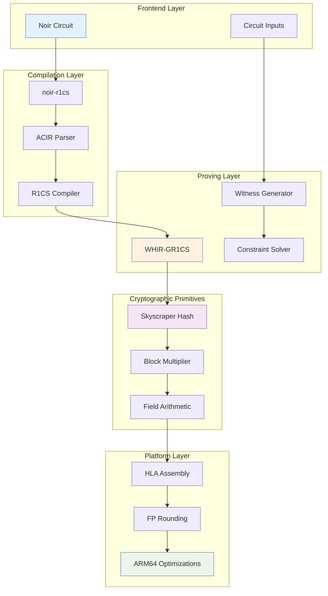

# Architecture Overview

ProveKit is designed as a modular, high-performance zero-knowledge proof system optimized for mobile and resource-constrained environments. This document provides a comprehensive overview of the system architecture.

## System Architecture



## Core Components

### 1. Frontend: Noir Integration

**Purpose**: High-level circuit description and compilation
**Location**: `noir-r1cs/`

- **ACIR Parser**: Converts Noir-compiled circuits to internal representation
- **Constraint Generation**: Transforms ACIR opcodes to R1CS constraints  
- **Witness Generation**: Computes satisfying assignments from inputs

### 2. Proving System: WHIR-GR1CS

**Purpose**: Zero-knowledge proof generation and verification
**Dependencies**: [WHIR](https://github.com/WizardOfMenlo/whir), Skyscraper

- **Polynomial Commitment**: Uses WHIR's polynomial commitment scheme
- **Constraint Encoding**: Encodes R1CS as polynomial relations
- **Proof Generation**: Creates succinct zero-knowledge proofs

### 3. Cryptographic Hash: Skyscraper

**Purpose**: High-performance hash function for Merkle trees
**Location**: `skyscraper/`

- **Custom Hash Function**: Optimized for ARM64 SIMD operations
- **Merkle Tree Operations**: Fast tree building and proof generation
- **Proof of Work**: Efficient nonce finding for consensus applications

### 4. Field Arithmetic: Block Multiplier

**Purpose**: Optimized finite field operations
**Location**: `block-multiplier/`

- **Montgomery Reduction**: Fast modular arithmetic
- **Vectorized Operations**: SIMD-parallel field multiplication
- **Assembly Generation**: Hand-tuned ARM64 implementations

### 5. Assembly Generation: HLA

**Purpose**: High-level assembly code generation
**Location**: `hla/`

- **Instruction Interleaving**: Optimal CPU pipeline utilization
- **Register Allocation**: Efficient hardware register usage
- **Code Generation**: Produces inline and standalone assembly

### 6. Platform Support: FP Rounding

**Purpose**: Floating-point rounding mode control
**Location**: `fp-rounding/`

- **FPCR Control**: Direct ARM64 floating-point control register manipulation
- **Safe Abstractions**: Rust-safe wrappers for unsafe operations
- **Cross-Platform**: x86_64 and ARM64 support

## Performance Architecture

### Optimization Layers

1. **Algorithm Level**: WHIR's polylogarithmic proof size
2. **Implementation Level**: Hand-tuned assembly for hot paths  
3. **Platform Level**: ARM64 SIMD and concurrent execution
4. **Memory Level**: Streaming computation and cache optimization

### Hot Paths

The performance-critical code paths are:

```rust
// 1. Field multiplication (>60% of proving time)
block_multiplier::scalar_mul(a, b) // <-- ARM64 assembly

// 2. Hash function (>25% of proving time)  
skyscraper::compress(input) // <-- Vectorized operations

// 3. Polynomial evaluation (>10% of proving time)
whir::polynomial::evaluate(coeffs, point) // <-- Batch operations
```

## Component Interactions

| Component | Depends On | Provides To |
|-----------|------------|-------------|
| `noir-r1cs` | Noir, WHIR | CLI tools, Libraries |
| `skyscraper` | `block-multiplier`, `fp-rounding` | `noir-r1cs`, WHIR |
| `block-multiplier` | `hla`, `fp-rounding` | `skyscraper` |
| `hla` | - | `block-multiplier` |
| `fp-rounding` | - | `block-multiplier`, `skyscraper` |

## Security Properties

1. **Zero Knowledge**: Proofs reveal nothing beyond statement validity
2. **Soundness**: Invalid statements cannot be proven (with high probability)
3. **Completeness**: Valid statements can always be proven
4. **Succinctness**: Proof size is polylogarithmic in circuit size

## Next Steps

Now that you understand the overall architecture, explore:

- [Quick Start](../getting-started/quick-start) - Build your first proof
- [Tutorials](../tutorials/basic-proof) - Step-by-step guides
- [Examples](../examples/) - Working code samples