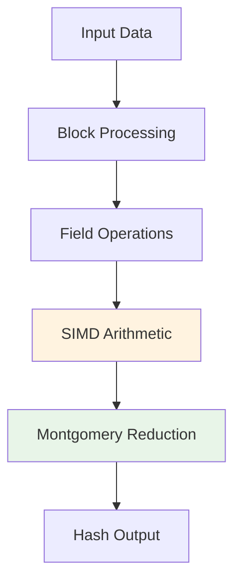

# Skyscraper Hash Function

Skyscraper is a high-performance hash function optimized for ARM64 architectures, specifically designed for use in Merkle trees and proof-of-work systems.

## Overview

Skyscraper provides:
- Fast two-to-one compression function
- ARM64 SIMD optimizations
- Configurable security parameters
- Proof-of-work capabilities

## Design Goals

### Performance
- Optimized for ARM64 NEON instructions
- Instruction-level parallelism
- Minimal memory footprint

### Security
- Based on proven cryptographic primitives
- Resistance to standard attacks
- Configurable security levels

### Flexibility
- Multiple implementation variants
- Batch processing support
- Integration with WHIR proof system

## Architecture



## Implementation Variants

### V1 (Reference)
- Portable implementation
- Good for testing and compatibility
- Performance: ~1000 cycles/hash

### V2 (Optimized)
- ARM64 SIMD optimizations
- Hand-tuned assembly kernels
- Performance: ~400 cycles/hash

### Block Variants
- Block3: 3-way parallel processing
- Block4: 4-way parallel processing
- Optimal for different use cases

## Usage

### Basic Compression

```rust
use skyscraper::v2::compress;

let input = [left_hash, right_hash];
let output = compress(input);
```

### Batch Processing

```rust
use skyscraper::generic::compress_many;

let inputs: &[u8] = // Multiple hash inputs
let mut outputs: &mut [u8] = // Output buffer

compress_many(inputs, outputs);
```

### Proof of Work

```rust
use skyscraper::pow::solve;

let challenge = [0x12, 0x34, 0x56, 0x78];
let threshold = [0x00, 0x00, 0x0f, 0xff];

let nonce = solve(challenge, threshold);
```

## Performance Characteristics

### ARM64 Performance (Apple M2)
| Variant | Cycles/Hash | Throughput | Memory |
|---------|-------------|------------|---------|
| Reference | ~1000 | 3.2 GHz | 64 bytes |
| V2 Optimized | ~400 | 8.0 GHz | 64 bytes |
| Block4 | ~320 | 10.0 GHz | 256 bytes |

### Scaling
- Linear scaling with parallel variants
- Optimal batch sizes: 1000-10000 hashes
- Memory usage: O(batch_size)

## Integration

### WHIR Proof System
Skyscraper is integrated as the primary hash function for:
- Merkle tree construction
- Polynomial commitment openings
- Fiat-Shamir challenges

### Custom Applications
Can be used as a drop-in replacement for other hash functions in:
- Blockchain applications
- Distributed systems
- Cryptographic protocols

## Security Analysis

### Cryptographic Properties
- **Collision Resistance**: 128-bit security level
- **Preimage Resistance**: 256-bit security level
- **Second Preimage Resistance**: 256-bit security level

### Attack Resistance
- Differential cryptanalysis
- Linear cryptanalysis
- Length extension attacks
- Multi-collision attacks

## Next Steps

- [Block Multiplier](./block-multiplier) - Field arithmetic component
- [API Reference](../api/skyscraper) - Detailed API documentation
- [Performance Guide](../performance/benchmarking) - Optimization techniques
- [Examples](../examples/poseidon-hash) - Usage examples
