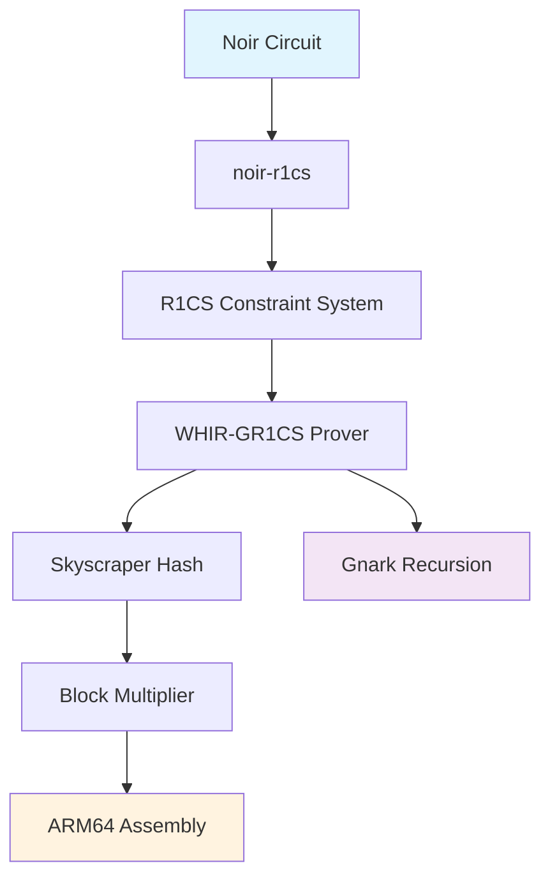

# Introduction to ProveKit

**ProveKit** is a zero-knowledge proof toolkit specifically designed for mobile devices and resource-constrained environments. It provides a complete stack for generating, verifying, and recursively composing zero-knowledge proofs with optimal performance on ARM64 architectures.

## What is ProveKit?

ProveKit enables developers to:

- **Compile Noir circuits** into efficient R1CS constraint systems
- **Generate fast proofs** using WHIR-GR1CS with Skyscraper hash functions
- **Recursively verify proofs** in Gnark for proof composition
- **Deploy on mobile devices** with optimized ARM64 assembly implementations

## Key Features

### 🚀 **Mobile-First Design**
Optimized specifically for ARM64 architectures with hand-tuned assembly implementations for critical operations.

### ⚡ **High Performance**
- Custom field arithmetic using Montgomery reduction
- SIMD-optimized operations with instruction-level parallelism  
- Skyscraper hash function for fast Merkle tree operations
- Memory-efficient constraint system representations

### 🔗 **Recursive Proofs**
Seamless integration with Gnark for proof recursion and composition, enabling complex proof systems.

### 🛠 **Developer Friendly**
Complete toolchain from Noir circuits to deployed mobile applications with comprehensive examples and documentation.

## Architecture Overview

ProveKit consists of several interconnected components:

## Current Status

:::warning Development Status
ProveKit is currently in **prototype stage** (v0.1.0). While functional, it should **not be used in production** environments yet.
:::

**Milestone Progress:**
- ✅ **Prototype (v0.1.0)** - Complete
- 🟡 **MVP (v0.2.0)** - In Progress (Target: June 2025)
- ⬜ **Release (v1.0.0)** - Planned (Target: August 2025)

## Quick Start

Ready to get started? Jump to our [Quick Start Guide](./getting-started/quick-start) to build your first proof in minutes.

## Community & Support

- **GitHub**: [worldfnd/ProveKit](https://github.com/worldfnd/ProveKit)
- **Issues**: [Report bugs or request features](https://github.com/worldfnd/ProveKit/issues)
- **Discussions**: [Ask questions and share ideas](https://github.com/worldfnd/ProveKit/discussions)
- **Contributing**: [Contribution Guidelines](./contributing)

## License

ProveKit is released under the [MIT License](https://github.com/worldfnd/ProveKit/blob/main/License.md).
